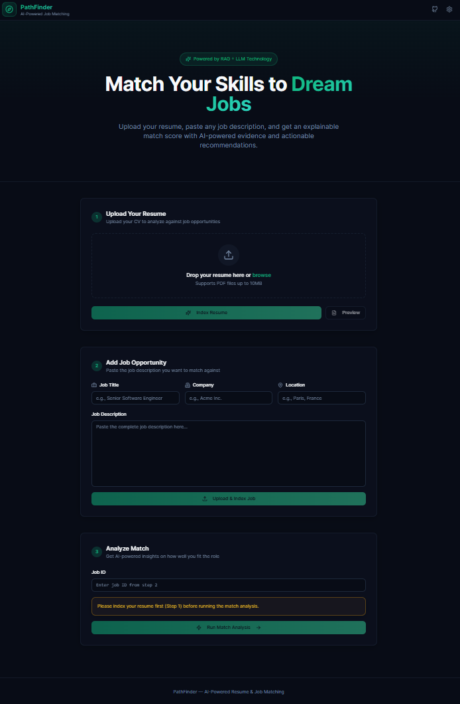
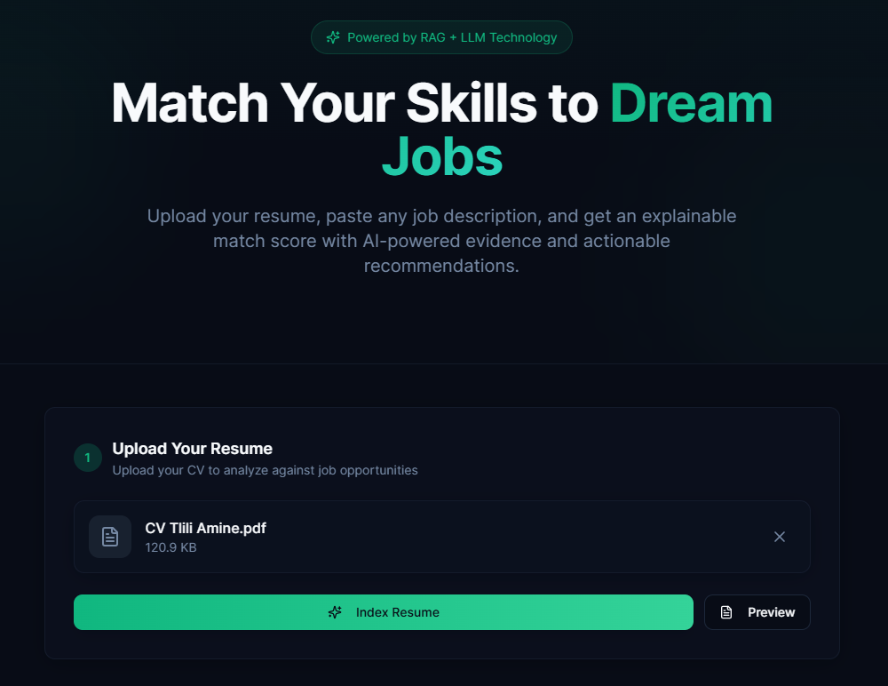
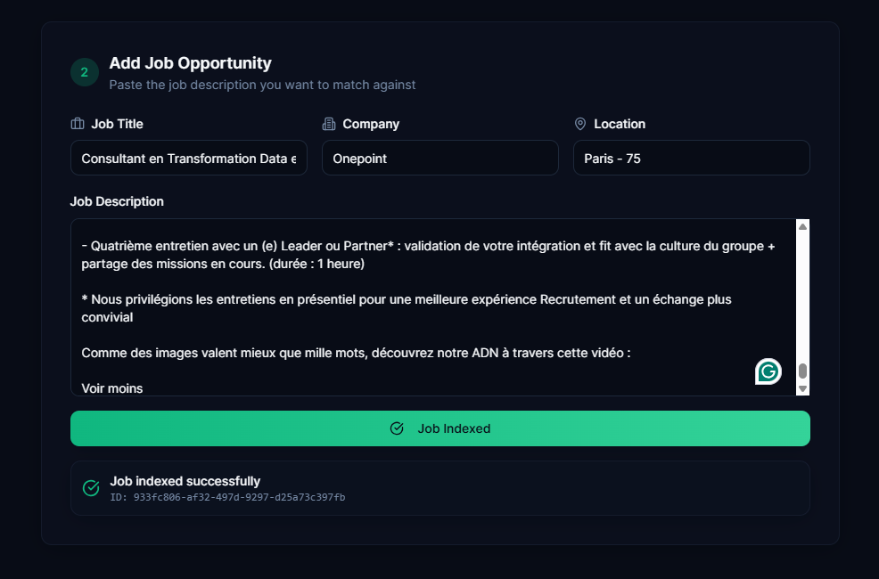
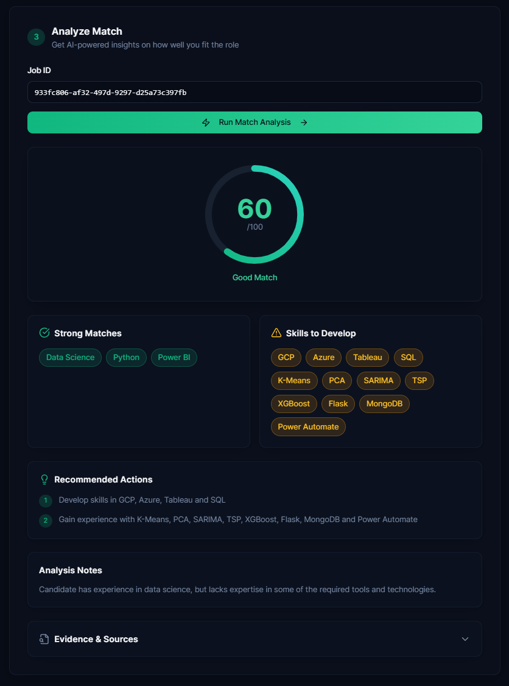

# PathFinder — CV ↔ Job Matching (RAG + LLM)

PathFinder is an AI-powered career intelligence web application that helps job seekers understand how well their profile matches a job offer.

  

It allows users to:
- Upload a resume (PDF)
- Paste a job description
- Receive an **explainable match score**
- Identify **strong matches**, **missing skills**, and **actionable recommendations**
- See **evidence-backed explanations** using Retrieval-Augmented Generation (RAG)

---

## ✨ Key Features

- 📄 Resume parsing and chunking (PDF)
- 🧠 Semantic search with vector embeddings
- 🔎 Resume ↔ Job matching using RAG
- 🤖 LLM-powered structured analysis (JSON output)
- 📊 Explainable results with evidence chunks
- 🌙 Modern dark-mode web UI
- 🔌 Local-first architecture (no cloud dependency required)

---

## 🖥️ Tech Stack

### Backend
- **FastAPI** — REST API
- **Python**
- **Sentence Transformers** — local embeddings
- **Chroma / in-memory vector store**
- **Ollama** — local LLM inference (default: `llama3.1:8b`)
- **PyMuPDF (fitz)** — PDF parsing

### Frontend
- **React (Vite)**
- **TypeScript**
- **Tailwind CSS**
- **shadcn/ui**
- **Dark mode enabled**

---

## 🧠 How It Works (RAG Pipeline)

1. The resume PDF is uploaded and parsed into text
2. The text is split into semantic chunks
3. Each chunk is embedded and stored in a vector store
4. The job offer is uploaded and embedded
5. At match time:
   - Relevant resume + job chunks are retrieved
   - An LLM analyzes both contexts
6. The LLM returns a **structured JSON response** including:
   - Match score (0–100)
   - Strong matching skills
   - Missing skills
   - Recommended actions
   - Evidence references (resume/job chunks)

---

## 🖼️ Screenshots

├── 01-Uploading Resume

├── 02-Uploading Job

└── 03-Match Result

---

## 📄 License

This project is for educational & portfolio purposes.